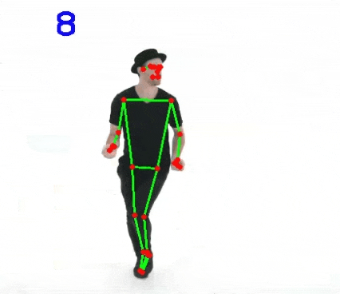

# Pose Estimation with OpenCV

This project demonstrates a basic implementation of stereo pose estimation using OpenCV in Python. It includes:

- Keypoint detection & matching
- Fundamental & Essential matrix computation
- Camera pose recovery via `cv2.recoverPose`
- Triangulation of 3D points from stereo pairs

Goal: To gain hands-on understanding of epipolar geometry and visual localization.

Reference: https://www.youtube.com/watch?v=brwgBf6VB0I

===========================================================================

You must install opencv-python(cv2) and mediapipe before excuting this module.

By the way, the python devolopment is ver3.9

===========================================================================

## Usage:

1. Put this module in any dirctory.
2. Put any media file (.mp4, .gif, etc.) in the same directory
3. Excute this module in cmd: python poseesti.py
4. Follow the instruction in the program
  a. input the file name (including the file extension)
  b. input the display rate (recommend 70+)

Enjoy!

